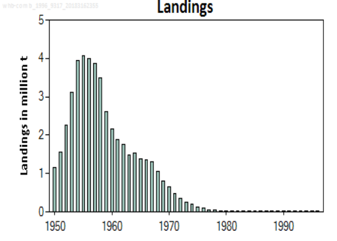

[](https://travis-ci.org/ices-tools-prod/icesSAG)
[](https://codecov.io/gh/ices-tools-prod/icesSAG)
[]()
[](https://cran.r-project.org/package=icesSAG)
[](https://cran.r-project.org/package=icesSAG)
[-blue.svg)](https://www.gnu.org/licenses/gpl-3.0.en.html)

[](http://ices.dk)

### icesSAG

icesSAG provides R functions that access the [web services](http://sg.ices.dk/webservices.aspx) of the [ICES](http://ices.dk) [Stock Assessment Graphs](http://sg.ices.dk) database.

icesSAG is implemented as an [R](https://www.r-project.org) package and available on [CRAN](https://cran.r-project.org/package=icesSAG).

### Installation

icesSAG can be installed from CRAN using the `install.packages` command:

``` r
install.packages("icesSAG")
```

### Usage

For a summary of the package:

``` r
library(icesSAG)
?icesSAG
```

### Examples

To download the summary data for all stocks published so far in 2017 use:

``` r
summary_data <- getSAG(stock = NULL, year = 2018)
head(summary_data)
```

    ##   Year recruitment high_recruitment low_recruitment low_SSB    SSB
    ## 1 1983   305664912        419413371       222765998  333683 475442
    ## 2 1984    76515202        105588421        55447142  146691 204638
    ## 3 1985   520343641        705099201       383999166  338797 460469
    ## 4 1986    77593949        107332767        56094900  214789 277618
    ## 5 1987    47157329         66359796        33511461  742378 995500
    ## 6 1988   204279559        279162440       149483355  443526 595407
    ##   high_SSB catches landings discards low_F     F high_F StockPublishNote
    ## 1   677425  378795   378795       NA 0.473 0.583  0.719  Stock published
    ## 2   285477  498626   498626       NA 0.535 0.659  0.811  Stock published
    ## 3   625836  437114   437114       NA 0.571 0.704  0.867  Stock published
    ## 4   358824  382844   382844       NA 0.385 0.472  0.578  Stock published
    ## 5  1334927  373021   373021       NA 0.299 0.369  0.455  Stock published
    ## 6   799298  413646   413646       NA 0.417 0.511  0.625  Stock published
    ##   Purpose Fage fishstock recruitment_age AssessmentYear  units
    ## 1  Advice  1-2 san.sa.1r               0           2018 tonnes
    ## 2  Advice  1-2 san.sa.1r               0           2018 tonnes
    ## 3  Advice  1-2 san.sa.1r               0           2018 tonnes
    ## 4  Advice  1-2 san.sa.1r               0           2018 tonnes
    ## 5  Advice  1-2 san.sa.1r               0           2018 tonnes
    ## 6  Advice  1-2 san.sa.1r               0           2018 tonnes
    ##   stockSizeDescription stockSizeUnits fishingPressureDescription
    ## 1                  SSB         tonnes                          F
    ## 2                  SSB         tonnes                          F
    ## 3                  SSB         tonnes                          F
    ## 4                  SSB         tonnes                          F
    ## 5                  SSB         tonnes                          F
    ## 6                  SSB         tonnes                          F
    ##   fishingPressureUnits
    ## 1               Year-1
    ## 2               Year-1
    ## 3               Year-1
    ## 4               Year-1
    ## 5               Year-1
    ## 6               Year-1

#### verbose web service calls

If you want to see all the web service calls being made set this option

``` r
options(icesSAG.messages = TRUE)
```

The result will be

``` r
codKeys <- findAssessmentKey("cod", year = 2017)
```

    ## GETing ... http://sg.ices.dk/StandardGraphsWebServices.asmx/getListStocks?year=2017

which allows you to investigate the actual web service data if you are interested: <http://sg.ices.dk/StandardGraphsWebServices.asmx/getListStocks?year=2017>

#### Authorised access via tokens

ICES provides public access to the results of published stock assessments. If you are an ICES stock assessor and wish to access unpublished results, or to upload your results, this can be done using token authentication.

You can generate a token from [sg.ices.dk/manage/CreateToken.aspx](https://sg.ices.dk/manage/CreateToken.aspx), which will be something like `e9351534-20ac-4ad4-9752-98923e011213`

Then create a file with the following contents (substitute the access token with your own)

    # Standard Graphs personal access token
    SG_PAT=e9351534-20ac-4ad4-9752-98923e011213

this should be saved in your home directory in a file called `.Renviron_SG`.

A quick way to do this from R is

``` r
cat("# Standard Graphs personal access token",
    "SG_PAT=e9351534-20ac-4ad4-9752-98923e011213",
    sep = "\n",
    file = "~/.Renviron_SG")
```

Once you have created this file, you should be able to access unpublished results and upload data to the SAG database. To switch to using authorised access run set the following flag

``` r
options(icesSAG.use_token = TRUE)
```

#### uploading data

To upload the results of a stock assessment to SAG you must provide two peiced of information, Stock information, such as stock code, assessment year and reference points, and yearly results, such as landings and estimated fishing mortality. There are two helper functions to create the required objects.

``` r
stockInfo()
```

returns a `list` (it requires a stock code, assessment year and contact email as a minimum), with the correctly named elements. And,

``` r
stockFishdata()
```

returns a `data.frame` (it requires year as default) with the correctly named columns

A simple (almost) minimal example is:

``` r
info <- stockInfo("whb-comb", 1996, "colin.millar@ices.dk")
fishdata <- stockFishdata(1950:1996)

# add the purpose of the assessment (typically Advice)
# see http://vocab.ices.dk/?ref=1516, for options
info$Purpose <- "Advice"

# simulate some landings for something a bit intesting
set.seed(1232)
fishdata$Landings <- 10^6 * exp(cumsum(cumsum(rnorm(nrow(fishdata), 0, 0.1))))

key <- icesSAG::uploadStock(info, fishdata)
```

    ## Converting to XML format ... Done
    ## Uploading                ... Success: (200) OK
    ## Screening file           ... Success: (200) OK
    ## Importing to database    ... Done
    ## Upload complete! New assessmentKey is: 9660
    ## To check upload run (with 'options(icesSAG.use_token = TRUE)'): 
    ##   findAssessmentKey('whb-comb', 1996, full = TRUE)

You can check that the data was uploaded by searching for our stock. Note you will need to make sure the icesSAG.use\_token option is set to TRUE

``` r
options(icesSAG.use_token = TRUE)
findAssessmentKey('whb-comb', 1996, full = TRUE)
```

    ##   AssessmentKey StockKeyLabel        Purpose StockDatabaseID StockKey
    ## 1          9331      whb-comb Initial Advice              NA   136737
    ## 2          9660      whb-comb         Advice              NA   136737
    ## 3          9344      whb-comb      Benchmark              NA   136737
    ##                                              StockDescription
    ## 1 Blue whiting in Subareas I-IX, XII and XIV (Combined stock)
    ## 2 Blue whiting in Subareas I-IX, XII and XIV (Combined stock)
    ## 3 Blue whiting in Subareas I-IX, XII and XIV (Combined stock)
    ##          Status AssessmentYear              SpeciesName ModifiedDate
    ## 1 Not Published           1996 Micromesistius poutassou   01/05/2018
    ## 2 Not Published           1996 Micromesistius poutassou   01/05/2018
    ## 3 Not Published           1996 Micromesistius poutassou   01/05/2018
    ##                          SAGStamp
    ## 1 whb-comb_1996_9331_201851105335
    ## 2 whb-comb_1996_9660_201851105335
    ## 3 whb-comb_1996_9344_201851105335

We can also look at the landings graph created from the data that were uploaded

``` r
plot(getLandingsGraph(key))
```



### References

ICES Stock Assessment Graphs database: <http://sg.ices.dk>

ICES Stock Assessment Graphs web services: <http://sg.ices.dk/webservices.aspx>

### Development

icesSAG is developed openly on [GitHub](https://github.com/ices-tools-prod/icesSAG).

Feel free to open an [issue](https://github.com/ices-tools-prod/icesSAG/issues) there if you encounter problems or have suggestions for future versions.

The current development version can be installed using:

``` r
library(devtools)
install_github("ices-tools-prod/icesSAG")
```
