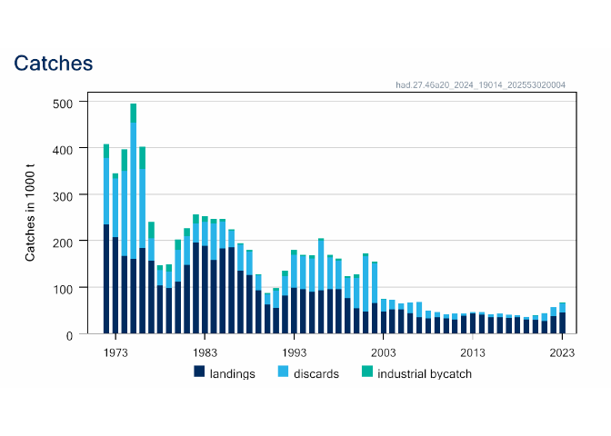

[](https://ices-tools-prod.r-universe.dev)
[](https://ices-tools-prod.r-universe.dev/icesSAG)

[]()
[-blue.svg)](https://www.gnu.org/licenses/gpl-3.0.en.html)

CRAN status:
[](https://cran.r-project.org/package=icesSAG)
 

[](http://ices.dk)

### icesSAG

icesSAG provides R functions that access the [web
services](http://sg.ices.dk/webservices.aspx) of the
[ICES](http://ices.dk) [Stock Assessment Graphs](http://sg.ices.dk)
database.

icesSAG is implemented as an [R](https://www.r-project.org) package and
is currently hosted on
[r-universe](https://ices-tools-prod.r-universe.dev)

We plan to submit icesSAG to CRAN in the near future.

<!---
available on [CRAN](https://cran.r-project.org/package=icesSAG).
--->

### Installation

icesSAG can be installed from CRAN using the `install.packages` command:

``` r
install.packages("icesSAG", repos = c("https://ices-tools-prod.r-universe.dev", "https://cloud.r-project.org"))
```

### Usage

For a summary of the package:

``` r
library(icesSAG)
?icesSAG
```

### Examples

To download the summary data for all sandeel stocks published in 2018
use:

``` r
summary_data <- getSAG(stock = "sandeel", year = 2023)
head(summary_data)
```

    ##   Year recruitment high_recruitment low_recruitment low_SSB    SSB high_SSB low_F     F high_F catches landings
    ## 1 1983   285000075        404690458       200709063  307520 452254   665108 0.478 0.596  0.744  382629       NA
    ## 2 1984    75526942        108094090        52771793  136696 194269   276092 0.540 0.674  0.840  498671       NA
    ## 3 1985   518266424        723794791       371099778  307364 431059   604534 0.577 0.720  0.898  460057       NA
    ## 4 1986    75376039        107979318        52616996  202400 265402   348014 0.389 0.484  0.602  382844       NA
    ## 5 1987    49081856         72043445        33438554  708828 977741  1348673 0.302 0.377  0.471  373021       NA
    ## 6 1988   201037095        284748295       141935577  420971 577810   793081 0.421 0.523  0.651  422805       NA
    ##   discards IBC Unallocated_Removals LandingsBMS TBiomass LogbookRegisteredDiscards StockPublishNote Purpose Fage
    ## 1       NA  NA                   NA          NA       NA                        NA  Stock published  Advice  1-2
    ## 2       NA  NA                   NA          NA       NA                        NA  Stock published  Advice  1-2
    ## 3       NA  NA                   NA          NA       NA                        NA  Stock published  Advice  1-2
    ## 4       NA  NA                   NA          NA       NA                        NA  Stock published  Advice  1-2
    ## 5       NA  NA                   NA          NA       NA                        NA  Stock published  Advice  1-2
    ## 6       NA  NA                   NA          NA       NA                        NA  Stock published  Advice  1-2
    ##   fishstock recruitment_age AssessmentYear  units stockSizeDescription stockSizeUnits fishingPressureDescription
    ## 1 san.sa.1r               0           2023 tonnes                  SSB         tonnes                      FALSE
    ## 2 san.sa.1r               0           2023 tonnes                  SSB         tonnes                      FALSE
    ## 3 san.sa.1r               0           2023 tonnes                  SSB         tonnes                      FALSE
    ## 4 san.sa.1r               0           2023 tonnes                  SSB         tonnes                      FALSE
    ## 5 san.sa.1r               0           2023 tonnes                  SSB         tonnes                      FALSE
    ## 6 san.sa.1r               0           2023 tonnes                  SSB         tonnes                      FALSE
    ##   fishingPressureUnits AssessmentKey AssessmentComponent
    ## 1                   NA         17718                   0
    ## 2                   NA         17718                   0
    ## 3                   NA         17718                   0
    ## 4                   NA         17718                   0
    ## 5                   NA         17718                   0
    ## 6                   NA         17718                   0

``` r
ggplot(summary_data[complete.cases(summary_data[c("Year", "recruitment")]),],
       aes(x=Year, y=recruitment, group = fishstock, colour = fishstock)) +
    geom_line()
```

<!-- -->

#### verbose web service calls

If you want to see all the web service calls being made set this option

``` r
sag_messages(TRUE)
```

The result will be

``` r
codKeys <- findAssessmentKey("cod", year = 2017)
```

which allows you to investigate the actual web service data if you are
interested: <https://sag.ices.dk/SAG_API/api/StockList?year=2017>

#### Authorised access via tokens

ICES provides public access to the results of published stock
assessments. If you are an ICES stock assessor and wish to access
unpublished results, or to upload your results, this can be done using
token authentication.

This is easy to set up, simply run the following line and all future
requests to the SAG database will be authenticated.

``` r
sag_use_token(TRUE)
```

#### uploading data

To upload the results of a stock assessment to SAG you must provide two
pieces of information, Stock information, such as stock code, assessment
year and reference points, and yearly results, such as landings and
estimated fishing mortality. There are two helper functions to create
the required objects.

``` r
stockInfo()
```

returns a `list` (it requires a stock code, assessment year and contact
email as a minimum), with the correctly named elements. And,

``` r
stockFishdata()
```

returns a `data.frame` (it requires year as default) with the correctly
named columns

A simple (almost) minimal example is:

``` r
info <-
  stockInfo(
    StockCode = "whb-comb",
    AssessmentYear = 1996,
    ContactPerson = "its_me@somewhere.gov",
    StockCategory = 3,
    Purpose = "",
    ModelType = "A",
    ModelName = "XSA"
  )
fishdata <- stockFishdata(1950:1996)

# simulate some landings for something a bit intesting
set.seed(1232)
fishdata$Landings <- 10^6 * exp(cumsum(cumsum(rnorm(nrow(fishdata), 0, 0.1))))

# you can create an XML file to upload yourself
xml <- createSAGxml(info, fishdata)

# or upload directly - not currently working...
# key <- uploadStock(info, fishdata)
```

You can check that the data was uploaded by searching for our stock.
Note you will need to make sure the icesSAG.use_token option is set to
TRUE

``` r
sag_use_token(TRUE)
findAssessmentKey('whb-comb', 1996, full = TRUE)
```

    ##   AssessmentKey StockKeyLabel    Purpose StockDatabaseID StockKey
    ## 1          9331      whb-comb InitAdvice              NA   136737
    ## 2          9344      whb-comb      Bench              NA   136737
    ## 3         11559      whb-comb       <NA>              NA   136737
    ## 4         11560      whb-comb       <NA>              NA   136737
    ## 5         11561      whb-comb       <NA>              NA   136737
    ##                                              StockDescription        Status AssessmentYear
    ## 1 Blue whiting in Subareas I-IX, XII and XIV (Combined stock) Not Published           1996
    ## 2 Blue whiting in Subareas I-IX, XII and XIV (Combined stock) Not Published           1996
    ## 3 Blue whiting in Subareas I-IX, XII and XIV (Combined stock) Not Published           1996
    ## 4 Blue whiting in Subareas I-IX, XII and XIV (Combined stock) Not Published           1996
    ## 5 Blue whiting in Subareas I-IX, XII and XIV (Combined stock) Not Published           1996
    ##                SpeciesName        ModifiedDate                          SAGStamp LinkToAdvice AssessmentComponent
    ## 1 Micromesistius poutassou 31/05/2024 11:13:05  whb-comb_1996_9331_2024531111305           NA                  NA
    ## 2 Micromesistius poutassou 31/05/2024 11:13:05  whb-comb_1996_9344_2024531111305           NA                  NA
    ## 3 Micromesistius poutassou 31/05/2024 11:13:05 whb-comb_1996_11559_2024531111305           NA                  NA
    ## 4 Micromesistius poutassou 31/05/2024 11:13:05 whb-comb_1996_11560_2024531111305           NA                  NA
    ## 5 Micromesistius poutassou 31/05/2024 11:13:05 whb-comb_1996_11561_2024531111305           NA                  NA

### Displaying graphs

We can also look at the landings graph created from the data that were
uploaded

``` r
plot(getLandingsGraph(key))
```

<!-- -->

or download all four summary graphs and display them in a 2x2 grid.

``` r
graphs <- getSAGGraphs(key)
plot(graphs)
```

<!-- -->

### References

ICES Stock Assessment Graphs database: <http://sg.ices.dk>

ICES Stock Assessment Graphs web services:
<http://sg.ices.dk/webservices.aspx>

### Development

icesSAG is developed openly on
[GitHub](https://github.com/ices-tools-prod/icesSAG).

Feel free to open an
[issue](https://github.com/ices-tools-prod/icesSAG/issues) there if you
encounter problems or have suggestions for future versions.

The current development version can be installed using:

``` r
library(devtools)
install_github("ices-tools-prod/icesSAG@development")
```
